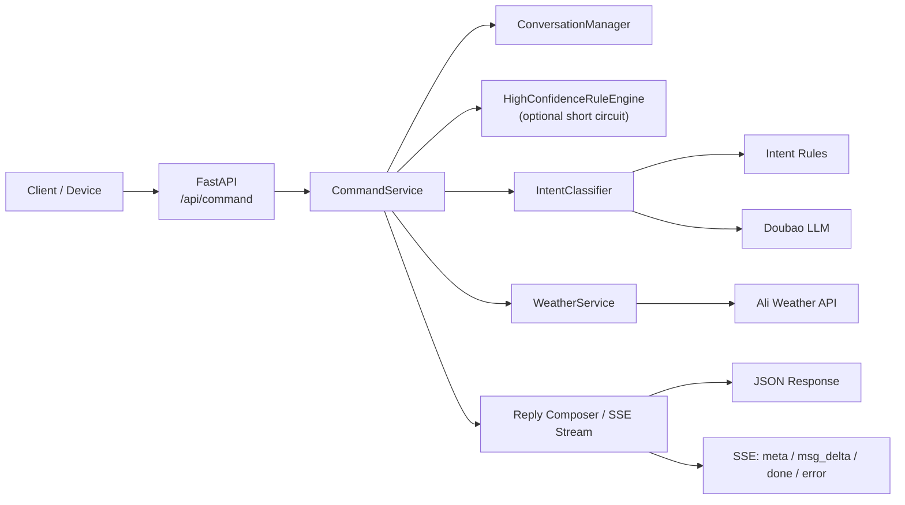

# XY Assistant


面向老年人智能健康设备的中文语义指令解析服务。

XY Assistant 不是一个“泛聊天 API”，而是一个偏执行型、可落地、可对接前端页面与硬件设备的语义理解后端。它以 `FastAPI` 为接口层，使用“规则引擎 + 豆包大模型”的混合架构，把用户自然语言转成稳定的结构化指令，支持多轮澄清、天气上下文、健康场景路由，以及 `SSE` 流式输出。

## 目录

- [项目定位](#项目定位)
- [核心能力](#核心能力)
- [快速体验](#快速体验)
- [架构概览](#架构概览)
- [项目结构](#项目结构)
- [快速开始](#快速开始)
- [配置说明](#配置说明)
- [接口概览](#接口概览)
- [测试与回归](#测试与回归)
- [部署](#部署)
- [相关文档](#相关文档)
- [贡献建议](#贡献建议)

## 项目定位

这个项目适合以下场景：

- 数字健康机器人、家庭陪护屏、语音音箱等设备的中文指令理解后端
- 既需要“自由表达”，又必须给前端返回稳定 `result / target / event / status` 结构的产品
- 天气、提醒、健康监测、健康科普、家庭医生、通话、娱乐、家政等 ToC 场景混合的语音入口
- 需要把“答复文案”和“可执行动作”拆开处理，而不是只返回一段聊天文本

与纯 LLM 聊天接口相比，XY Assistant 更强调：

- 确定性：高频能力优先规则命中，降低误触发
- 可执行：返回结构化字段，便于前端跳页、设备执行或二次确认
- 可澄清：低置信度场景保留会话态，支持多轮补充
- 可扩展：新增意图可沿着 `definitions -> rules -> prompt -> tests` 的链路扩展

## 核心能力

- 混合语义理解：规则引擎处理高确定性场景，大模型处理模糊表达和自然问答
- 多轮会话管理：自动生成 `sessionId`，保留近期上下文与澄清状态
- 执行型意图解析：支持天气、闹钟、提醒、音量/亮度、健康监测、家庭医生、通话、娱乐、商城、家政等场景
- 健康场景增强：支持健康科普、健康画像、健康评估、用药计划、名医问诊等老年健康相关入口
- 天气上下文注入：支持城市解析、日期解析、实时天气拉取、天气条件判断与口语化播报
- 流式输出：`/api/command` 支持 `SSE` 模式，前端可按 `meta / msg_delta / done / error` 事件消费
- 完整回归链路：覆盖单元测试、端到端测试、模糊用例回归、SSE 场景验证

## 快速体验

### 1. 标准 JSON 请求

```bash
curl -X POST http://127.0.0.1:8000/api/command \
  -H "Content-Type: application/json" \
  -d '{
    "sessionId": "demo-alarm-001",
    "query": "帮我订个明天早上6点的闹钟",
    "city": "长沙",
    "meta": {"device": "speaker"}
  }'
```

示例响应：

```json
{
  "code": 200,
  "msg": "好的，我已经为您设置好明天早上6点的闹钟啦。",
  "sessionId": "demo-alarm-001",
  "requiresSelection": false,
  "function_analysis": {
    "result": "新增闹钟",
    "target": "2026-03-10 06:00:00",
    "event": "",
    "status": null,
    "parsed_time": "2026-03-10 06:00:00",
    "time_text": "明天早上6点",
    "confidence": 0.95,
    "need_clarify": false
  }
}
```

### 2. SSE 流式请求

```bash
curl -N -X POST http://127.0.0.1:8000/api/command \
  -H "Content-Type: application/json" \
  -d '{
    "sessionId": "demo-weather-001",
    "query": "现在多少度",
    "stream": true
  }'
```

示例事件序列：

```text
event: meta
data: {"code":200,"sessionId":"demo-weather-001", ...}

event: msg_delta
data: {"content":"长沙"}

event: msg_delta
data: {"content":"现在"}

event: done
data: {"code":200,"msg":"长沙现在多云，气温19℃。", ...}
```

## 架构概览



从请求链路上看，项目大体分为四层：

- 接口层：FastAPI 路由、请求/响应模型、SSE 输出
- 理解层：规则、意图分类器、目标纠偏、会话上下文
- 领域能力层：天气、日历、时间、健康、娱乐、通话等业务规则
- 工程保障层：测试、模糊回归脚本、Docker 构建文档、结构化数据集

## 项目结构

```text
xy-assistant/
├── app/
│   ├── core/                 # 配置加载
│   ├── routers/              # FastAPI 路由
│   ├── schemas/              # 请求、响应、SSE 事件模型
│   ├── services/             # 指令编排、意图分类、天气、LLM 客户端
│   ├── utils/                # 时间/城市/文本等工具函数
│   └── data/                 # 城市等静态资源
├── data/                     # 意图数据集与模板
├── tests/                    # pytest 单元与集成测试
├── tools/                    # 模糊回归、SSE 验证、数据生成脚本
├── Dockerfile                # Docker 镜像构建
├── README.md
├── DOCKER_DEPLOYMENT.md      # Docker 构建、运行与分发说明
├── command_intent_mapping.csv
├── order_fuzzy.csv
└── pyproject.toml
```

## 快速开始

### 环境要求

- Python `3.10+`
- 建议使用虚拟环境
- 若需完整能力，准备豆包 API Key 和天气服务 AppCode

### 安装依赖

```bash
pip install -e .[dev]
```

### 配置环境变量

```bash
cp .env.example .env
```

至少需要配置：

- `DOUBAO_API_KEY`
- `DOUBAO_API_URL`
- `DOUBAO_MODEL`

如果要启用天气能力，还需要：

- `WEATHER_API_ENABLED=true`
- `WEATHER_API_APP_CODE=...`

### 启动服务

```bash
uvicorn app.main:app --host 0.0.0.0 --port 8000 --reload
```

启动后可访问：

- Swagger UI: `http://127.0.0.1:8000/docs`
- ReDoc: `http://127.0.0.1:8000/redoc`
- Health Check: `http://127.0.0.1:8000/health`

## 配置说明

常用环境变量如下：

| 变量 | 作用 | 默认/建议 |
| --- | --- | --- |
| `DOUBAO_API_KEY` | 豆包模型访问密钥 | 必填 |
| `DOUBAO_MODEL` | 默认模型 ID | `doubao-seed-2-0-mini-260215` |
| `CONFIDENCE_THRESHOLD` | 触发澄清的置信度阈值 | `0.7` |
| `ENABLE_HIGH_CONFIDENCE_RULES` | 是否启用高置信规则短路 | 建议按场景开启 |
| `WEATHER_API_ENABLED` | 是否启用天气 API | `true` |
| `WEATHER_DEFAULT_CITY` | 默认天气城市 | `长沙市` |
| `WEATHER_CACHE_TTL` | 天气缓存时间 | `600` |
| `WEATHER_REALTIME_CACHE_TTL` | 严格实时天气缓存 | `60` |
| `WEATHER_LLM_ENABLED` | 是否用 LLM 辅助天气理解 | `true` |
| `WEATHER_BROADCAST_LLM_ENABLED` | 是否用 LLM 润色天气播报 | `true` |

配置约定：

- `.env.example` 应保留在仓库中，作为模板
- `.env` / `.env.docker` 只用于本地或部署环境，不应提交真实值
- 本地工具配置和测试输出应通过 `.gitignore` 管理

## 接口概览

### `GET /health`

服务健康检查。

示例响应：

```json
{"status": "ok"}
```

### `POST /api/command`

核心语义指令解析接口。

请求字段：

| 字段 | 类型 | 必填 | 说明 |
| --- | --- | --- | --- |
| `query` | `string` | 是 | 用户原始自然语言 |
| `sessionId` | `string` | 否 | 会话 ID，用于多轮澄清 |
| `meta` | `object` | 否 | 设备或上下文元数据 |
| `user` | `string` | 否 | 候选用户列表，如 `小张,小杨` |
| `city` | `string` | 否 | 当前定位城市 |
| `stream` | `boolean` | 否 | 是否启用 SSE 流式输出 |

响应核心字段：

| 字段 | 说明 |
| --- | --- |
| `msg` | 面向用户的回复文案 |
| `requiresSelection` | 是否需要前端进入二次选择 |
| `function_analysis.result` | 识别到的能力入口或功能名称 |
| `function_analysis.target` | 目标参数，如时间、对象、城市、内容 |
| `function_analysis.need_clarify` | 是否需要继续澄清 |
| `function_analysis.reasoning` | 规则/模型决策的解释信息 |

### SSE 事件类型

启用 `stream=true` 后，服务会输出以下事件：

- `meta`：结构化结果已确定，前端可先渲染功能状态
- `msg_delta`：分片回复内容
- `done`：最终完整响应
- `error`：流式过程中出现异常

## 测试与回归

### 单元 / 集成测试

```bash
pytest
```

按模块执行：

```bash
pytest tests/test_intent_rules.py
pytest tests/test_intent_classifier.py
pytest tests/test_weather_service.py
pytest tests/test_end_to_end.py
```

### 模糊回归

```bash
python tools/run_fuzzy_tests.py --endpoint http://0.0.0.0:8000/api/command
```

特点：

- 支持在线调用接口
- 在受限环境下可回退到进程内本地调用
- 可输出 `msg / result / target / 匹配判断`

### SSE 验证

```bash
python tools/test_stream_report.py
python tools/test_stream_full_report.py
```

## 部署

### 构建前准备

当前仓库的 `Dockerfile` 会在构建阶段把 `.env.docker` 复制到镜像内的 `.env`，因此构建前请先准备该文件：

```bash
cp .env.example .env.docker
```

然后按实际环境填写 `.env.docker` 中的模型和天气配置。

### 本地构建 Docker 镜像

```bash
DOCKER_CONTEXT=default docker buildx build \
  --platform linux/amd64 \
  --tag xy-assistant:latest \
  --load .
```

### 导出镜像

```bash
docker save xy-assistant:latest -o xy-assistant-latest.tar
```

### 本地运行容器

```bash
docker run --rm \
  --name xy-assistant \
  -p 8000:8000 \
  --env-file .env.docker \
  xy-assistant:latest
```

说明：

- 当前镜像默认监听 `8000` 端口
- 运行时传入 `--env-file .env.docker` 可以覆盖同名环境变量
- 如果你不希望把敏感配置烘焙进镜像，需要先调整 `Dockerfile` 再构建

更完整的部署说明见 [DOCKER_DEPLOYMENT.md](./DOCKER_DEPLOYMENT.md)。

## 相关文档

- [DOCKER_DEPLOYMENT.md](./DOCKER_DEPLOYMENT.md)：当前仓库的 Docker 构建、运行与镜像分发说明
- 本文“接口概览”章节：当前 API 请求字段、响应结构与 SSE 事件说明

## 贡献建议

如果你要扩展一个新意图，建议沿着下面的路径修改：

1. 在 `app/services/intent_definitions.py` 添加或更新 `IntentCode`
2. 在 `app/services/intent_rules.py` 增加规则命中逻辑
3. 在 `app/services/prompt_templates.py` 同步 LLM 提示词约束
4. 在 `tests/` 中补齐至少一组规则测试和一组分类/端到端测试

对于执行型功能，优先保证：

- `result` 稳定
- `target` 可执行
- 低置信度时能自然澄清
- 回归脚本可以覆盖到新增场景

## 适合谁

如果你正在做下面这些产品，这个项目会比“通用大模型聊天接口”更贴近落地：

- 语音助手后端
- 健康机器人 / 陪护设备
- 中文多意图执行引擎
- 需要结构化动作路由的 AI Agent 前置解析层

如果你希望项目首页继续升级，我下一步建议补两样东西：

- 一张真实的请求链路/功能页截图
- 一份 benchmark 或 intent coverage 的公开指标
