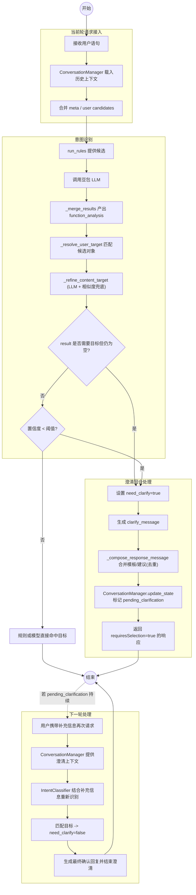

# 多轮澄清流程

该流程展示当模型无法直接确认目标对象或信息时，如何生成澄清消息并在后续轮次继续处理。

```mermaid
flowchart TD
    start((开始))

    subgraph request["当前轮请求接入"]
        r1["接收用户语句"]
        r2["ConversationManager 载入历史上下文"]
        r3["合并 meta / user candidates"]
    end

    subgraph classify["意图识别"]
        c1["run_rules 提供候选"]
        c2["调用豆包 LLM"]
        c3["_merge_results 产出 function_analysis"]
        c4["_resolve_user_target 匹配候选对象"]
        c5["_refine_content_target (LLM + 相似度兜底)"]
        c6{"result 是否需要目标但仍为空?"}
        c7{"置信度 < 阈值?"}
    end

    subgraph clarify["澄清回合处理"]
        q1["设置 need_clarify=true"]
        q2["生成 clarify_message"]
        q3["_compose_response_message 合并模板/建议(去重)"]
        q4["ConversationManager.update_state<br/>标记 pending_clarification"]
        q5["返回 requiresSelection=true 的响应"]
    end

    subgraph next_turn["下一轮处理"]
        n1["用户携带补充信息再次请求"]
        n2["ConversationManager 提供澄清上下文"]
        n3["IntentClassifier 结合补充信息重新识别"]
        n4["匹配目标 -> need_clarify=false"]
        n5["生成最终确认回复并结束澄清"]
    end

    fallback["规则或模型直接命中目标"]
    finish((结束))

    start --> r1 --> r2 --> r3 --> c1 --> c2 --> c3 --> c4
    c4 --> c5 --> c6
    c6 -- 否 --> c7
    c6 -- 是 --> q1
    c7 -- 是 --> q1
    c7 -- 否 --> fallback --> finish

    q1 --> q2 --> q3 --> q4 --> q5 --> finish

    finish -. 若 pending_clarification 持续 .-> n1
    n1 --> n2 --> n3 --> n4 --> n5 --> finish
```
