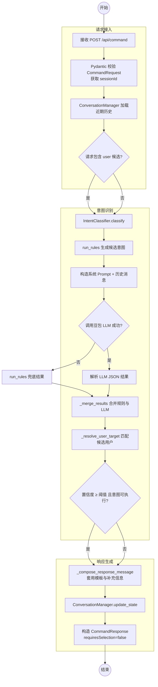

# 单轮命中功能流程

该流程覆盖典型的单轮意图（如“帮我订个6点的闹钟”）从请求到返回确认的关键步骤。

```mermaid
flowchart TD
    start((开始))

    subgraph request["请求接入"]
        r1["接收 POST /api/command"]
        r2["Pydantic 校验 CommandRequest<br/>获取 sessionId"]
        r3["ConversationManager 加载近期历史"]
        r4{"请求包含 user 候选?"}
    end

    subgraph classify["意图识别"]
        c1["IntentClassifier.classify"]
        c2["run_rules 生成候选意图"]
        c3["构造系统 Prompt + 历史消息"]
        c4{"调用豆包 LLM 成功?"}
        c5["解析 LLM JSON 结果"]
        c6["_merge_results 合并规则与 LLM"]
        c7["_resolve_user_target 匹配候选用户"]
        c8{"置信度 ≥ 阈值 且意图可执行?"}
    end

    subgraph response["响应生成"]
        s1["_compose_response_message<br/>套用模板与补充信息"]
        s2["ConversationManager.update_state"]
        s3["构造 CommandResponse<br/>requiresSelection=false"]
    end

    fallback["run_rules 兜底结果"]
    finish((结束))

    start --> r1 --> r2 --> r3 --> r4
    r4 -- 是 --> c1
    r4 -- 否 --> c1
    c1 --> c2 --> c3 --> c4
    c4 -- 否 --> fallback --> c6
    c4 -- 是 --> c5 --> c6
    c6 --> c7 --> c8
    c8 -- 是 --> s1
    c8 -- 否 --> s1
    s1 --> s2 --> s3 --> finish
```

