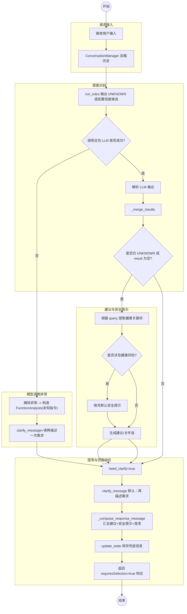

# 未知功能与异常兜底流程

该流程覆盖未匹配功能、健康咨询建议场景以及模型调用失败的兜底策略。

```mermaid
flowchart TD
    start((开始))

    subgraph request["请求接入"]
        r1["接收用户输入"]
        r2["ConversationManager 加载历史"]
    end

    subgraph classify["意图识别"]
        c1["run_rules 输出 UNKNOWN 或低置信度候选"]
        c2{"调用豆包 LLM 是否成功?"}
        c3["解析 LLM 输出"]
        c4["_merge_results"]
        c5{"是否仍 UNKNOWN 或 result 为空?"}
    end

    subgraph advice["建议与安全提示"]
        a1["根据 query 提取健康关键词"]
        a2{"是否涉及健康风险?"}
        a3["填充默认安全提示"]
        a4["生成建议/关怀语"]
    end

    subgraph clarify["澄清与兜底响应"]
        q1["need_clarify=true"]
        q2["clarify_message 默认：再描述需求"]
        q3["_compose_response_message 汇总建议+安全提示+澄清"]
        q4["update_state 保存兜底信息"]
        q5["返回 requiresSelection=true 响应"]
    end

    subgraph exception["模型调用异常"]
        e1["捕获异常 -> 构造 FunctionAnalysis(未知指令)"]
        e2["clarify_message=请再描述一次需求"]
    end

    finish((结束))

    start --> r1 --> r2 --> c1 --> c2
    c2 -- 是 --> c3 --> c4 --> c5
    c2 -- 否 --> e1 --> e2 --> q1
    c5 -- 是 --> a1 --> a2
    a2 -- 是 --> a3 --> a4 --> q1
    a2 -- 否 --> a4 --> q1
    c5 -- 否 --> q1
    q1 --> q2 --> q3 --> q4 --> q5 --> finish
```

